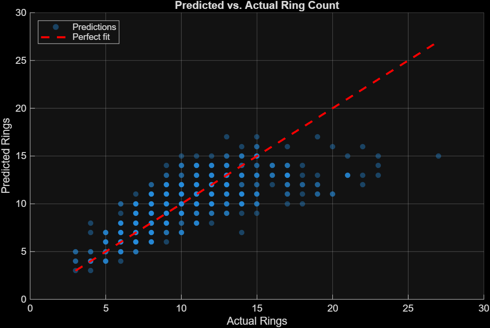
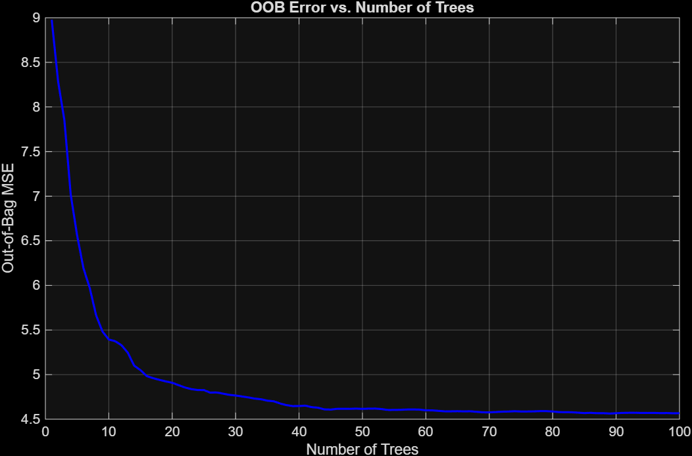
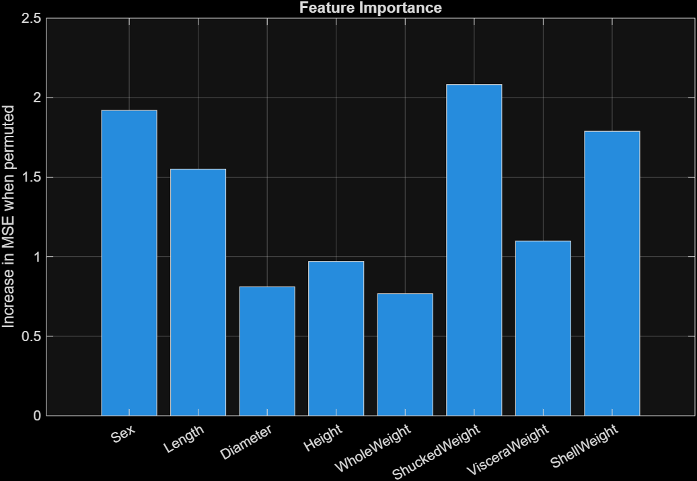
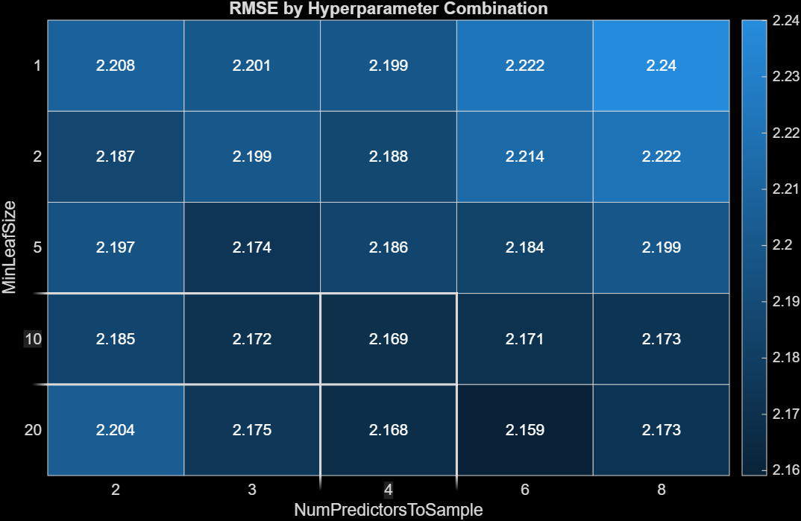
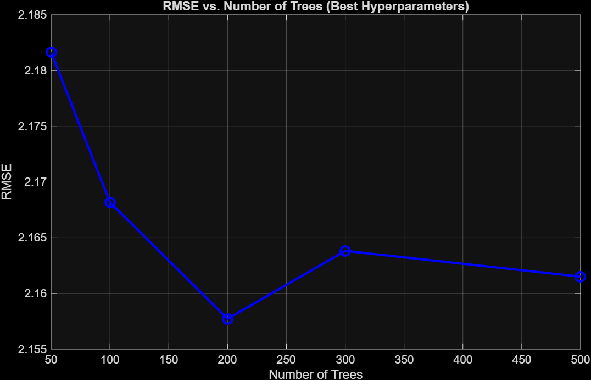
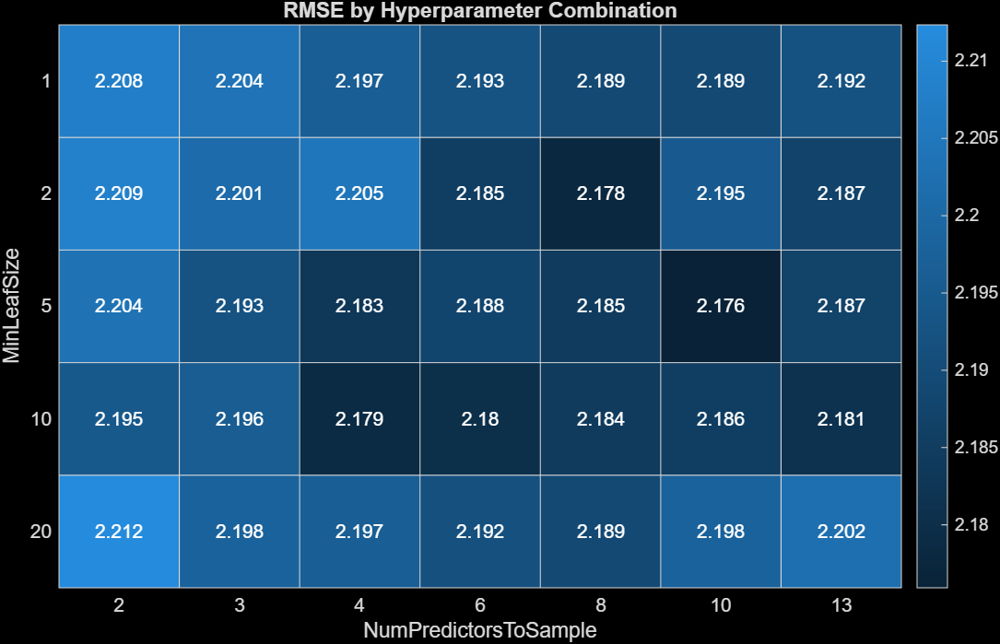
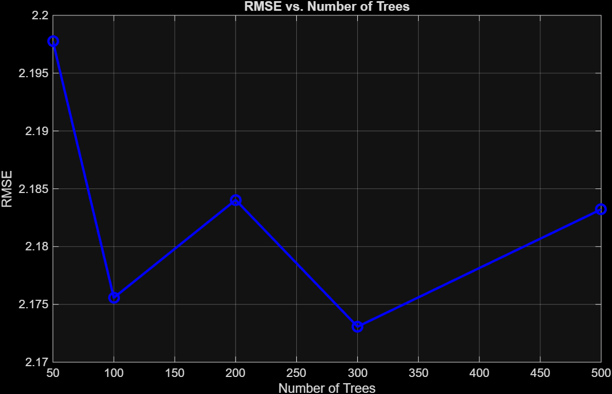
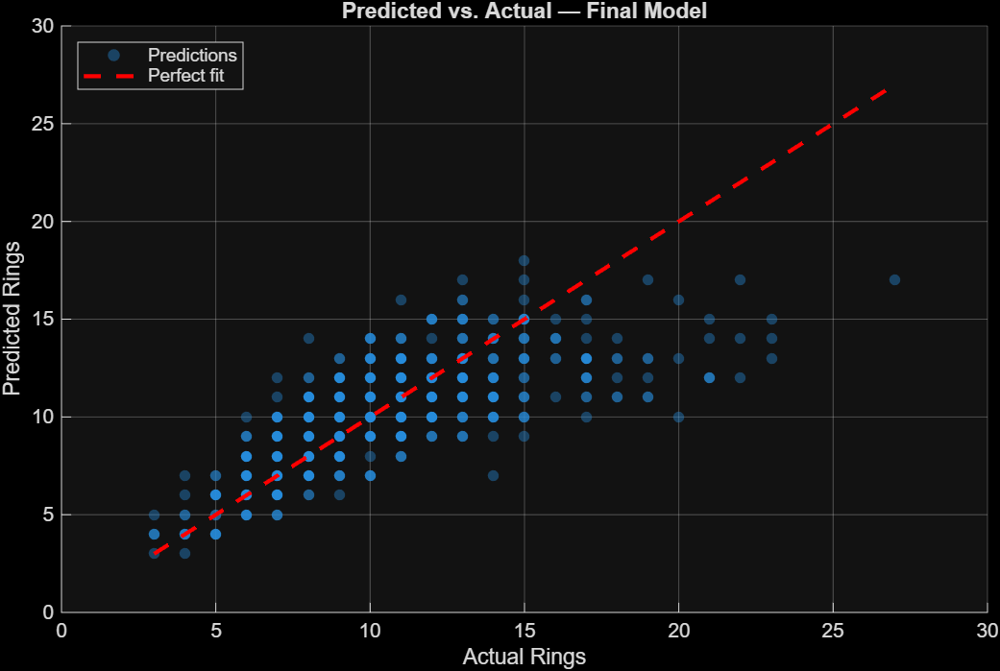
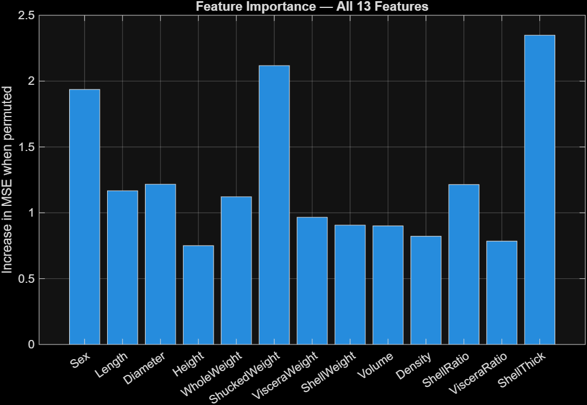

# MLProject

## mcen3030-mlproject-tpittz
mcen3030-mlproject-tpittz created by GitHub Classroom

# <ins>A Machine Learning Approach to Calculating the Age of Abalone Snails Without Shucking</ins>

  Tiernan Pittz

## Initial Prompt and Response
Initial prompt, posed to Claude AI, was "I'd like to do a machine learning project where the age of a sea snail (abalone) is the goal, based on the number of rings on their shell. Currently, this is determined by using their "shucked weight," which involves killing the snail. Instead, I'd like to use the snails' size and live weight. The data set that the network will be trained on contains these columns in order: Sex (M,F, or I (infant)); Length; Diameter; Height; Whole weight; shucked weight; viscera weight; shell weight; and # of rings. The end goal is to find the number of rings, which is correlated to the age by adding 1.5 to it. lengths are in mm, weights in g. What is the best way to model this data set in MATLAB?"
The LLM responded, asking what approach I would like to take, to which I said I would like to start with a random forest approach because it will be easier to interpret. Then, we made the decision to disregard the invasive features from the data set, so that the network could be trained on just the data we would want.

## Why a Random Forest Approach?
The random forest approach means that the model will be trained by asking yes or no questions (a "decision tree"). To quote the LLM, the model will "learn a series of questions from the training data:

'Is the shell weight > 0.2g?'
→ Yes → 'Is the diameter > 110mm?'
→ No → 'Is the whole weight < 0.5g?' ...and so on."

This approach would eventually settle upon a final ring count, which lets the tree then learn which questions to ask, and what questions have the most effect on the end goal. However, the limitation is that if you let the tree ask enough questions, it will eventually just memorize the training data exactly, without actually 'learning,' which will mean it fails on new data. To solve this, you take a forest approach, meaning many trees.

To make each tree distinct, two strategies of randomness are introduced: the seeding of each tree's training data, and the features the tree can consider. For example, the first tree will be able to use rows 1, 1, 4, 7, 9, etc, while the second will use rows 2, 3, 3, 6, 8, etc. In addition, at each decision point, the tree will only get to learn from a random subset of the features from the dataset, like length, whole weight, and sex, rather than all eight features given. Thus, each tree is slightly different and each make slightly different errors. Finally, the forest is averaged, which gives the most accurate determination of the snail's age.

## Inital Code, Predicted vs Actual plot, and Discussion
My initial code, found in the [code_1 file](code_1.m), returned this plot for a predicted versus actual ring count based on the training and then the testing subsets of data (using around 80% training set, 20% testing from the original [abalone data file](abalone.csv)).

  Plot of Predicted v. Actual Ring Count

As you can see in this image, the data falls along a relatively straight, increasing line. This shows that the model is already relatively accurate in determining the ring count in the snail's shell. Another plot, this time of the Out-Of-Bag (OOB) Error versus Number of Trees, shows how the error will decrease as our forest gets larger.

Plot of OOB Error

This model shows clearly how steeply the error is minimized by the random forest approach, especially how effective the approach is at reducing error by adding many trees. Since this is the main idea of the method, it confirms the belief that a random forest regressor was an effective method for this problem.

I also generated an early feature importance plot for this version of the model, as the LLM told me that a potential way to tune the model would be to engineer some features and change the number of features that the model had to pull from. That plot is below, and will be useful in conjunction with the final feature importance plot after tuning.

Initial Feature Importance Plot

## Tuned Model and Discussion
I began tuning the model by sweeping the hyperparameters for number of trees and leaf size, and then optimized a model based on those results in the [code_2 file](code_2.m). I generated a heatmap to see what combination of hyperparameters did the best, as shown below:

Heatmap showing minimum leaf size versus number of predictors to sample, to optimize the hyperparameters

Another sweep that I did was to find the optimum number of trees in my random forest, which is shown in the plot below:

Plot of RMSE versus Number of Trees in the Model

This plot shows that the optimum number of trees for the model to be most accurate was 200. These changes were made, and a tuned model was used on the same data.

The second set of tuning that I did was feature engineering. This was the LLM's idea, and it did serve to lower the RMSE. To do this, some new features were engineered to help the model, bringing our number of features up from 8 to 13. These were placed before the sweeps from before, so that they would be evaluated on each sweep run. With this round of tuning, found in the [code_3 file](code_3.m), I generated a new heatmap of those hyperparameter combinations, as well as another plot of RMSE versus tree count.

Heatmap of new hyperparameter combinations

Updated plot of RMSE versus Number of Trees in the Model

These two models showed slightly different results than the first round of tuning, specifically that the optimum tree count is actually 300, not 200. The key change, however, was the increase in the number of features that the model was trained on.

## Final Feature Importance Plot and Discussion of the Results
The final model improved its performance, as shown in this new plot of predicted versus actual age in the snails:

  

  Final Predicted versus actual age of the snails

After tuning and training the final model, a feature importance plot was generated. This means that the changes in individual features were compared to the changes in the predicted ages of the snails, so that we can determine which features are most decisive in determining the snails weight. The final feature importance plot is below:

Final Plot of feature importance, using all 13 feature including engineered features.

In comparison with the original feature importance plot, we see a few things stand out. First, in the original model, shucked weight was the most important feature (~2.08). This means that the method for finding the snails age before this model was created is the best way to do it; killing the snail has the greatest effect on what its age might be. This is biologically significant because it shows that the metabolic growth of the snails can only be hinted at by external, nondestructive measurements. However, in the final feature importance plot, including the engineered features, a new most important feature emerged: shell thickness, which was calculated by dividing the weight of the shell by the surface area of the shell. This also makes sense, as the number of layers in a snails' shell directly correlates to the thickness of the shell, so the age and thickness of the shell are also correlated.

## Conclusion
[This model](code_3.m) was trained to estimate the age of an abalone snail based on its sex, length, height, and a few other measurements that can be made while the snail is still alive. This contradicts the long-term usage of shucking the snail to determine its age, which kills the snail. By using a random forest approach, and tuning the hyperparameters as well as engineering a few new features, the model was refined until it could determine the snail's age accurately. 
